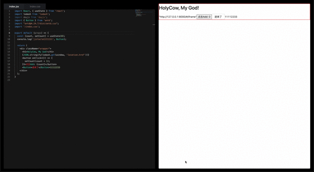

# code-editor-preview

小而美的在线 React 组件代码编辑器，动态渲染及实时预览。

本地启动：`http://127.0.0.1:8000/#/code`

## 版本功能

### 0.2.1

> 在 0.2.0 基础上

- 新增编辑器保存时自动格式化代码
- 新增组件 less 样式编码及解析

### 0.2.0

> 在 0.1.0 基础上

- 新增支持切换组件 jsx 及 css 样式 Tab 切换编辑和保存
- 新增支持引入 index.css（例如：import '/index.css'; /index.css 为了区别其他包的 css 资源，以“/”开头）

### 0.1.0

- 支持 React Hooks 组件开发
- 支持引入不同版本的 umd 包（例如：import lodash from "lodash@@4.17.21"）
- 支持引入其他包的 css 资源（例如：import "antd@4.24.7/dist/antd.css"）
- 支持编辑组件 jsx 代码并保存

## 实现原理

- 通过 babel 解析组件 jsx 代码并提取依赖，动态加载对应的 cdn umd 资源；
- 右侧实现预览部分通过 iframe 构造渲染沙箱环境，其中 new Function 执行 jsx 代码；
- 左侧编辑器利用 monaco editor 实现代码编辑和保存到 localStorage，其中构造不同的 model 实现 jsx 和 css 的编辑器切换；
- 通过 postmessage 方式实现左侧保存代码后，将保存到 localStorage 代码 sendMessage 到右侧 iframe 页面触发更新渲染；
- 动态加载的包样式和 index.css 样式，分别用 link 标签和 style 标签嵌入到 iframe 页面中的 body 内顶部，且模块 link 标签始终在 style 标签之前；
